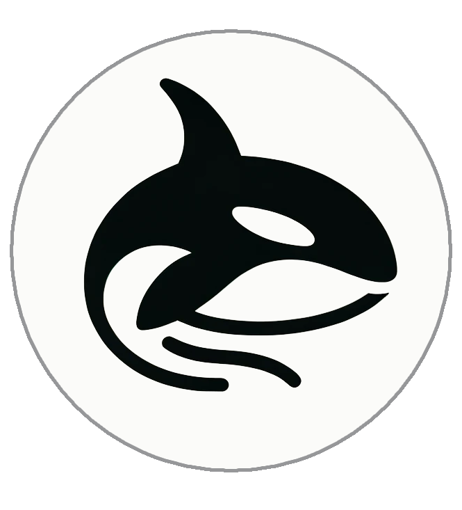

---
layout:
  title:
    visible: true
  description:
    visible: true
  tableOfContents:
    visible: true
  outline:
    visible: true
  pagination:
    visible: true
---

# 🐋 Orcajoy - about us

***

<figure><figcaption></figcaption></figure>

## 🎉 Welcome to Orcajoy

Orcajoy is a unique art platform dedicated to exploring profound themes such as psychology, philosophy, metacognition, knowledge methods, inner reflection, faith, and emotions. We package these themes into NFTs through various entertainment elements like music, songs, short films, and textual information, providing users with a unique collecting experience.

### 🔑 Key Features

* <mark style="color:green;">**Free Minting NFTs**</mark>: All users can freely mint some NFTs and participate in collecting.
* <mark style="color:orange;">**Fans Card**</mark>: Allows minting all NFTs on our platform, including exclusive ones and more thematic series to be launched in the future.
* <mark style="color:yellow;">**Orcajoy Coin Rewards**</mark>: By holding free minting or Fans-exclusive NFTs, users can receive airdrops and participate in activities to earn reward coins.

### 🌟 Our Vision

We are committed to helping more people find inspiration in art and gain enlightenment through entertainment. By collecting and sharing, we aim to build a community full of creativity and thoughtful engagement.

\
