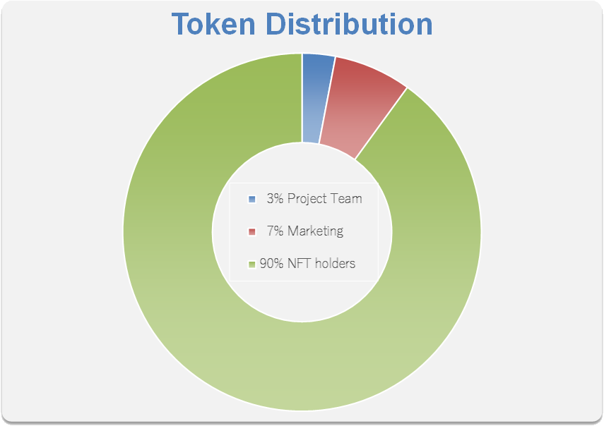

# 🪙 About Orcajoy Coin

**Orcajoy Coin (ERC20):**

* **Minting Method:** NFT airdrop, promotion rewards.
* **Supply:** 1 billion, transferable.
* **Additional Value:** Purchase exclusive content, participate in exclusive activities, vote on governance.
* **Acquisition Method:** No presale, no private sale, no fundraising.

**Additional Information:**

* The token serves as an incentive for platform activities, conditions for minting NFTs, and for voting purposes. It has no intrinsic value and is not pegged to any stablecoin or other tokens.
* The Fan Card and Sponsor Card are solely for supporting artistic creation and receiving art-related rewards. We do not promise any value investment or returns from the tokens.
* The tokens will be distributed over 4 years.
  * 3% of the total supply will be held by the project platform.
  * 7% will be used as rewards for marketing and promotional activities.
  * 90% will be airdropped to NFT holders or participants in activities involving NFT holdings.

<figure><figcaption></figcaption></figure>

***

⚠️**Note:** This is our initial plan and it may be adjusted as circumstances change. Please stay tuned for our latest updates and announcements.
