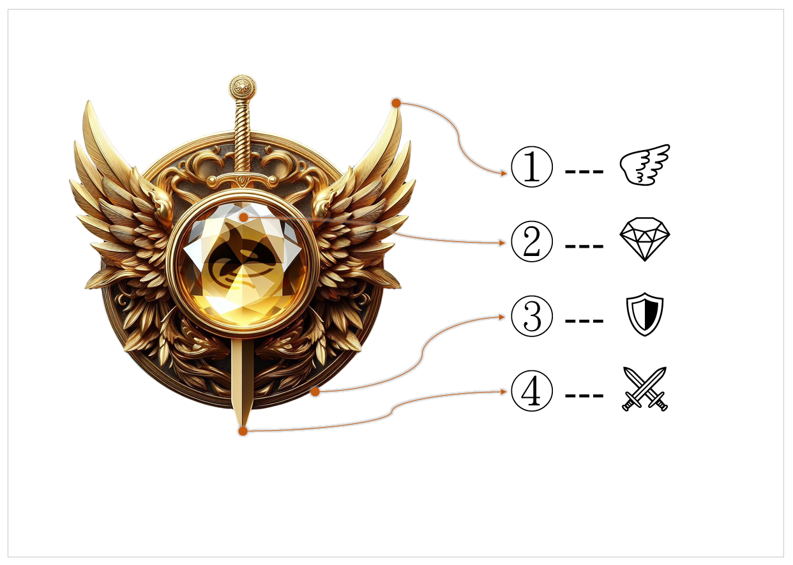
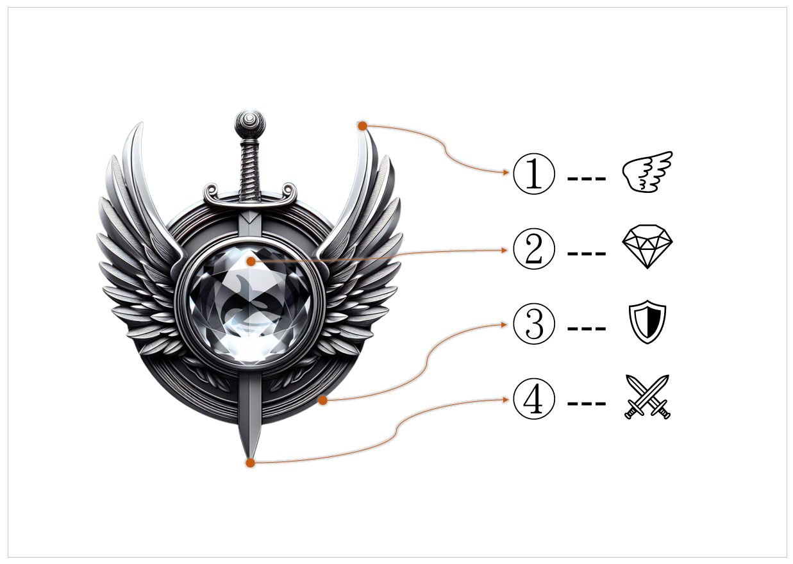
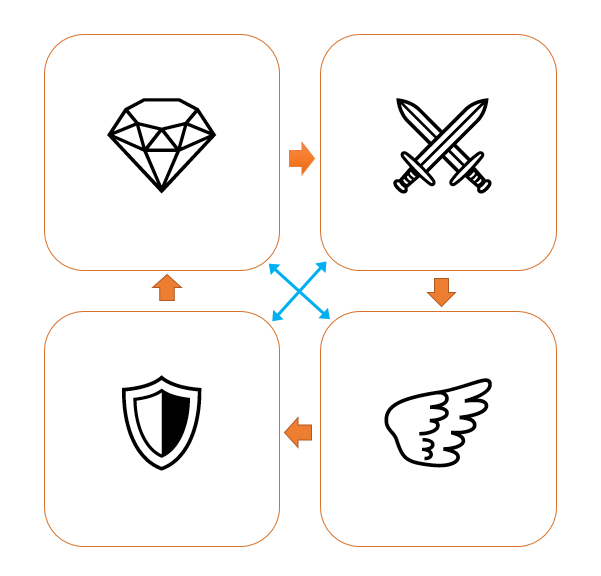

# 🎴 Fan Card Introduction

## OrcaJoy Sponsor Gold Card

<figure><figcaption>
OrcaJoy Sponsor Gold Card
</figcaption></figure>

## Orcajoy fan silver card

<figure><figcaption>
Orcajoy fan silver card
</figcaption></figure>

Our membership cards feature a badge with a gemstone and wings, as shown in the image. The symbolic meanings of the elements are as follows:

* **Wings**: Symbolize freedom, creativity, breakthrough, rebirth, pursuit, adventure, goal, etc.
* **Diamond**: Symbolizes wisdom, awakening, reflection, insight, knowledge, decision-making, planning, etc.
* **Shield**: Symbolizes protection, persistence, perseverance, focus, logic, confidence, integration, etc.
* **Sword**: Symbolizes challenge, action, courage, determination, facing obstacles, overcoming, efficiency, etc.

<figure><figcaption></figcaption></figure>

Among them, wings and diamond, shield and sword, complement each other:

In the realm of wisdom, a gemstone shines bright,\
Guiding the sword to act with courage and might.\
On wings of freedom, creativity takes flight,\
As the shield stands strong, protecting what we love.

Four elements united, in harmony they thrive,\
A badge of honor, inspiring lives to strive.

## **Theme Song of the Fan Card:**&#x20;



### **Wings of the Sword 劍之翼**

oh\~ yeah, oh\~ yeah

In the dark, we find our way,\
With courage bold, we seize the day.\
Steel wings spread, a sword so bright,\
Through the tempest, we claim our flight.

Guardians of wisdom, shields we bear,\
Protecting those we love, we care.\
Knowledge gleams, a precious gem,\
Step by step, we rise again.

From the ashes, we are reborn,\
A legacy of power, we adorn.\
Wings of freedom, we ascend,\
Together strong, until the end.

Wings of the sword, we soar above,\
Unbound and free, with strength and love.\
Every challenge, every stand,\
Our spirit shines across the land.

oh\~ yeah, oh\~ yeah

***

For more pricing and sales information : [here](comparison-of-nft-card-types.md)
