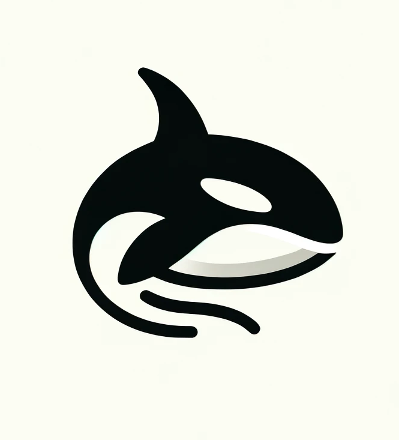

# 📄 Free Guest and Fan Member License

<figure><figcaption></figcaption></figure>

## Free Guest and Fan Member License

This page serves as the Usage License & Terms, detailing the licensing terms for the creations you download from orcajoy.com and related social media platforms..

***

<table data-full-width="false"><thead><tr><th width="353"></th><th width="207" align="center"></th><th align="center"></th></tr></thead><tbody><tr><td>🆔Identity</td><td align="center">👥 Guests</td><td align="center">💎Fans</td></tr><tr><td>🎧Download Format</td><td align="center">MP3</td><td align="center">WAV (Lossless)</td></tr><tr><td>🎨Personal Non-commercial Use</td><td align="center">✔️</td><td align="center">✔️</td></tr><tr><td>❤️Social Media Sharing</td><td align="center">✔️</td><td align="center">✔️</td></tr><tr><td>📢Public playing</td><td align="center">✔️</td><td align="center">✔️</td></tr><tr><td>🎉Events playing (e.g., parties, street dance, performances)</td><td align="center">✔️</td><td align="center">✔️</td></tr><tr><td>🍺Commercial and non-commercial settings (e.g., nightclubs, pubs, gyms) playing</td><td align="center">✔️</td><td align="center">✔️</td></tr><tr><td>🔀Remix or Adaptation</td><td align="center">✔️</td><td align="center">✔️</td></tr><tr><td>🎤Covers</td><td align="center">✔️</td><td align="center">✔️</td></tr><tr><td>📝No attribution required</td><td align="center">❌</td><td align="center">✔️</td></tr><tr><td><strong>And More...</strong></td><td align="center"></td><td align="center"></td></tr><tr><td>🎵Priority Download of Future Tracks</td><td align="center">❌</td><td align="center">✔️</td></tr><tr><td>🗝️Access to Exclusive Content</td><td align="center">❌</td><td align="center">✔️</td></tr><tr><td>🎁Points Rewards (Crypto-ERC20)</td><td align="center">✔️⭐</td><td align="center">✔️⭐⭐⭐⭐⭐</td></tr></tbody></table>

***

## 📋Free Guests & Fan Members Details

Free Guests can download creations for free from this website (orcajoy.com) or associated social media platforms without registration or licensing fees. Fan Members are those who hold our issued Fan Silver Card and Sponsor Gold Card NFTs. Whether you purchased your Fan Card from our website or received it as a gift, you are considered a fan in our Fan Members.

## 👥Free Guests License:

We adopt the CC BY-NC-SA license, allowing personal non-commercial use, public performance at offline events such as street dance, parties, nightclubs, and pubs, as well as activity playback, playing in stores and business premises, and non-commercial derivative works. You can create non-commercial derivative works, mix or remix it into your own creations, perform covers or sing the songs, and freely share them on your social media platforms. Attribution to the creator is required, and a backlink to **OrcaJoy.com** must be provided.

## 💎Fan Members License:

In addition to the freedom of non-commercial playback and derivative works, fan members enjoy more rights, including No attribution required, lossless quality downloads, priority access to future tracks, exclusive content access, and points rewards (Crypto-ERC20).

***

### ⚠️ Please note:

**1.Disclaimer**: By using our items, please ensure compliance with local laws, and respect the rights of individuals and groups.

2.This licensing page provides information about the scope of the license and permitted uses of the works when downloading. It is not an official legal document and does not carry the legal value or binding force of a sale or purchase agreement.

3.The benefits and privileges for Fan Members (including Fan Silver Card and Sponsor Gold Card holders) are not part of a commercial transaction or sale of goods. They are tokens of appreciation for supporting our website and project.


You can save this page by printing,screenshots, saving as PDF, or other methods.



In case of any changes to the content or licensing terms, please refer to the latest version of this page.

