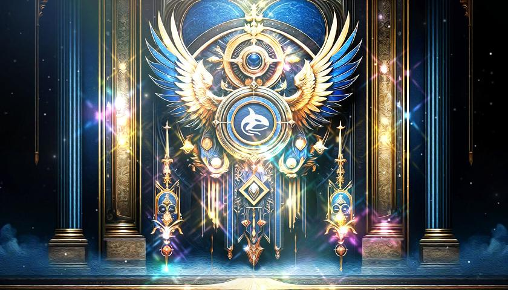

# 🎶 Heroic Graph: A Vast Synthesis

## 英雄皇圖:萬象歸宗 - Heroic Graph: A Vast Synthesis

<figure><figcaption>
Heroic Graph: A Vast Synthesis
</figcaption></figure>

### **Project Introduction:**

Human knowledge and culture, enriched by AI development and the increasing flow of information, offer a wealth of materials and backgrounds for personal emotions and inspiration. We aim to find an entertaining and enlightening way to synthesize and encapsulate these rich treasures. Our goal is to identify key and important representatives from various fields such as psychology, philosophy, metacognition, methodology of knowledge, belief, science, history, culture, art, and technology... etc. We will transform and package these into condensed experience units, such as a song or a short film, integrating lyrics, visual art, music, and narrative, and presenting them as NFTs. This will provide a series of synthetic works that are both convenient and rich in content.

#### Major Conceptual Themes:

Psychology, Philosophy, Metacognition, Methodology of Knowledge, Belief, Science, History, Culture... and more.

### **Implementation Method:**

<figure><figcaption></figcaption></figure>

We use metacognitive analysis methods, which include:

* **Thinking Angles**: Approaching problems from multiple perspectives to uncover hidden connections and insights.
* **Thinking Levels**: Seamlessly switching between abstract and concrete levels to build deep understanding.
* **Key Tags**: Extracting core elements of issues to promote connections and transitions.

We consider the creativity of entertainment elements and the intellectual content of inspiring elements, extracting and relating key ideas from different fields to form materials, which are then packaged for expression.

### **Experience Method:**

Our project will generate materials (such as music and images) and NFTs. We will provide different quality versions for public free use and for our members and fans. Specifically, as free public materials, you can download music, mint free NFTs, and receive reward tokens. By becoming our fan members, you can experience high-quality original materials, music, hidden and exclusive NFTs, and receive more token rewards.

### **Project Progress:**

We have currently completed a small portion of the works, and we will gradually release them. However, this is a journey that requires continuous development and creation. We hope to gain everyone's support and encouragement. May we always hold on to hope and beauty. Thank you all.

####
